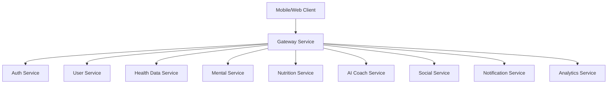

# HealthLife - Health & Wellness Microservices Platform

Production-ready, cloud-native platform for health and wellness management built on Spring Boot 3, Java 21, and Kubernetes.

## Architecture Overview

HealthLife is a distributed microservices architecture consisting of:

- **Gateway Service** - API gateway, reverse proxy, rate limiting, security headers
- **Auth Service** - JWT-based authentication, MFA, password reset, email verification
- **User Service** - User profile management
- **Health Data Service** - Health metrics, activity, sleep, symptoms tracking
- **Mental Service** - Mood tracking, meditation, breathing exercises, journal entries
- **Nutrition Service** - Food logging, nutrition analysis
- **AI Coach Service** - AI-driven insights and recommendations
- **Social Service** - Community features, challenges, friendships
- **Notification Service** - Push and email notifications
- **Analytics Service** - Data aggregation and reporting



## Technology Stack

| Layer | Technology |
|-------|-----------|
| Language | Java 21 (LTS) |
| Framework | Spring Boot 3.2.5 |
| Cloud | Spring Cloud 2023.0.1 |
| Security | Spring Security, JWT (jjwt), BCrypt |
| Data | PostgreSQL 16, Redis 7, Spring Data JPA |
| Messaging | Apache Kafka |
| Resilience | Resilience4j (circuit breaker, retry, rate limiter) |
| Observability | Micrometer, Prometheus, Zipkin distributed tracing |
| Logging | SLF4J + Logback with JSON structured logging |
| Testing | JUnit 5, AssertJ, Testcontainers, REST-assured |
| Build | Maven 3.9+ |
| Containers | Docker, Eclipse Temurin JRE 21 Alpine |
| Orchestration | Kubernetes, Helm 3 |
| CI/CD | GitHub Actions |

## Local Development

### Prerequisites

- JDK 21
- Maven 3.9+
- Docker & Docker Compose
- (Optional) Kubernetes cluster (minikube, kind, or Docker Desktop)

### Start Infrastructure

```bash
# Using Make
make local-up

# Using PowerShell
.\build.ps1 -Target local-up
```

This starts PostgreSQL, Redis, and Kafka containers.

### Build & Test

```bash
# Format check
make format-check

# Compile
make build

# Run tests
make test

# Full verification
make verify
```

### Run a Service

```bash
cd services/auth-service
mvn spring-boot:run -Dspring-boot.run.profiles=local
```

### API Documentation

Each service exposes OpenAPI/Swagger UI:

- Auth Service: http://localhost:8081/swagger-ui.html
- Gateway: http://localhost:8080/swagger-ui.html
- ...and so on for other services

## Deployment

### Kubernetes (Helm)

```bash
helm upgrade --install healthlife ./k8s/helm/healthlife \
  --namespace healthlife \
  --create-namespace \
  --set image.tag=1.0.0
```

### kubectl

```bash
kubectl apply -f k8s/base/namespace.yaml
kubectl apply -f k8s/base/
```

## Environment Variables

| Variable | Description | Default |
|----------|-------------|---------|
| `SPRING_PROFILES_ACTIVE` | Active Spring profile | `production` |
| `JWT_SECRET` | HS256 signing key | (required) |
| `SPRING_DATASOURCE_URL` | PostgreSQL JDBC URL | (per service) |
| `SPRING_DATASOURCE_USERNAME` | DB username | `healthlife` |
| `SPRING_DATASOURCE_PASSWORD` | DB password | (required) |
| `SPRING_DATA_REDIS_HOST` | Redis host | `localhost` |
| `MAIL_USERNAME` | SMTP username | (empty) |
| `MAIL_PASSWORD` | SMTP password | (empty) |

## Monitoring & Alerting

- **Metrics**: Prometheus scraping at `/actuator/prometheus`
- **Health**: Kubernetes probes at `/actuator/health/liveness` and `/actuator/health/readiness`
- **Tracing**: Zipkin/B3 propagation across services
- **Alerts**: PrometheusRules for high error rate, latency, and pod crash looping

## Security Practices

- Non-root container users (UID 1000)
- Read-only root filesystems
- Security headers (CSP, HSTS, X-Frame-Options)
- OWASP dependency scanning in CI/CD
- Trivy container image scanning
- NetworkPolicies restricting inter-namespace traffic

## Project Structure

```
.
├── services/              # Microservices
│   ├── gateway-service/
│   ├── auth-service/
│   ├── user-service/
│   ├── health-data-service/
│   ├── mental-service/
│   ├── nutrition-service/
│   ├── ai-coach-service/
│   ├── social-service/
│   ├── notification-service/
│   └── analytics-service/
├── shared/                # Shared libraries
│   ├── common-dto/
│   ├── common-security/
│   └── common-exceptions/
├── k8s/                   # Kubernetes manifests
│   ├── base/
│   ├── helm/healthlife/
│   └── monitoring/
├── infrastructure/        # Docker Compose for local dev
├── docs/                  # Documentation
└── mobile/                # React Native mobile app
```

## License

Proprietary - HealthLife Platform
