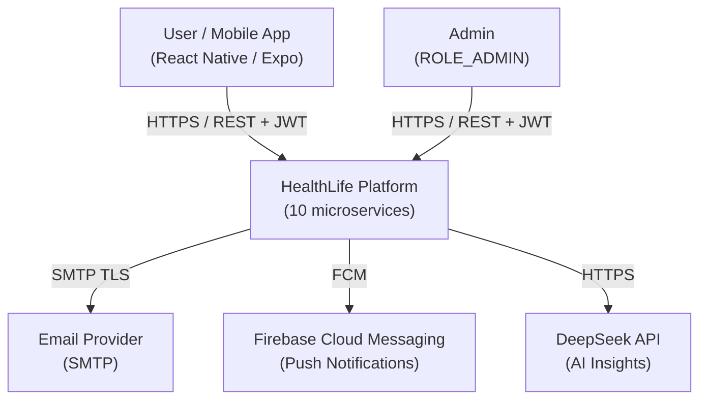
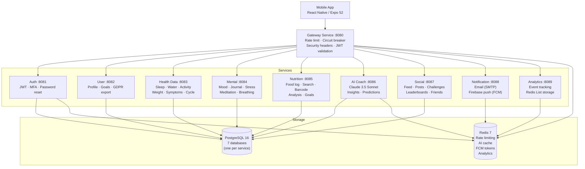

# HealthLife Architecture

## C4 Model

### Context Diagram (Level 1)



### Container Diagram (Level 2)



## Request Flow

```
1. Mobile app sends HTTPS request with Bearer JWT to Gateway :8080
2. Gateway:
   a. Validates JWT signature (HS256)
   b. Checks rate limit (Redis INCR — 300 req/min/user, 100 req/min/IP)
   c. Validates path (rejects ../traversal sequences)
   d. Removes hop-by-hop headers
   e. Forwards to target service via RestTemplate (circuit breaker + retry)
3. Target service:
   a. Re-validates JWT via JwtAuthenticationFilter
   b. Extracts userId from SecurityContext
   c. Executes business logic
   d. Persists to PostgreSQL via JPA (Flyway-managed schema)
4. Response flows back through Gateway to client
```

## Shared Libraries

```
shared/
├── common-exceptions/   — ResourceNotFoundException, UnauthorizedException,
│                          BadRequestException, ForbiddenException,
│                          DuplicateResourceException, TokenRefreshException
├── common-dto/          — All request/response DTOs for all services
│                          (auth, health, mental, nutrition, social, user, aicoach)
└── common-security/     — JwtTokenProvider, JwtAuthenticationFilter,
                           DefaultSecurityConfig (@EnableMethodSecurity),
                           CorsConfig (env-configurable origins),
                           ResilienceConfig, SecurityUtils
                           (getCurrentUserId, getCurrentUserEmail)
```

## Database Design

Each service owns its own PostgreSQL database — **database-per-service** pattern.

| Service | Database | Hot Tables (partitioned) |
|---------|----------|--------------------------|
| auth-service | healthlife_auth | users, refresh_tokens |
| user-service | healthlife_user | user_profiles, user_goals |
| health-data-service | healthlife_healthdata | sleep_entries *, water_entries *, activity_entries * |
| mental-service | healthlife_mental | mood_entries, journal_entries |
| nutrition-service | healthlife_nutrition | food_log_entries, foods |
| ai-coach-service | healthlife_aicoach | ai_insights |
| social-service | healthlife_social | posts, challenge_participants |

\* Hash-partitioned by `user_id` into 8 partitions (Flyway V2 migration).

## Resilience Patterns

| Pattern | Implementation | Config |
|---------|---------------|--------|
| Circuit Breaker | Resilience4j | 50% failure threshold, 30s open wait, slow call > 3s |
| Retry | Resilience4j | 3 attempts, 1s wait, IOException + TimeoutException |
| Rate Limiter | Redis INCR (atomic) | 300 req/min/user, 100 req/min/IP |
| Bulkhead | Dedicated thread pool | AI Coach: 20 core threads for DeepSeek API calls |
| Timeout | RestTemplate + WebClient | Connect 5s, Read 30s, DeepSeek 35s |
| Graceful Shutdown | Spring lifecycle | 30s timeout, preStop sleep 10s |

## Observability

```
Metrics:   /actuator/prometheus  →  Prometheus (15s scrape)  →  Grafana
Tracing:   B3 propagation        →  Zipkin (10% sampling)
Logging:   JSON (logstash)       →  stdout  →  log aggregator
Health:    /actuator/health/liveness   (Kubernetes liveness probe)
           /actuator/health/readiness  (Kubernetes readiness probe)
```

## Kubernetes Architecture

```
Namespace: healthlife
├── Deployments (10 services)
│   ├── replicas: 2 (min) — 6-10 (max via HPA)
│   ├── RollingUpdate: maxSurge=1, maxUnavailable=0
│   ├── PodDisruptionBudget: minAvailable=1
│   └── VPA: updateMode=Off (recommendations only)
├── HPA (10 autoscalers)
│   ├── CPU target: 70%
│   └── Memory target: 80% (gateway only)
├── StatefulSets
│   ├── postgres (1 replica, 5Gi PVC)
│   └── redis (1 replica, 1Gi PVC, appendonly + maxmemory-policy allkeys-lru)
├── Ingress (nginx)
│   ├── TLS via cert-manager (Let's Encrypt)
│   └── ssl-redirect: true
└── NetworkPolicy (default deny, explicit allow)

Namespace: monitoring
├── kube-prometheus-stack
│   ├── Prometheus (30d retention, 50Gi)
│   ├── Alertmanager (Slack + PagerDuty routing)
│   └── Grafana (Service Overview + SLO dashboards)
└── ServiceMonitor → scrapes all services with label monitoring=enabled
```

## Technology Decisions

| Decision | Rationale |
|----------|-----------|
| Microservices | Independent scalability, team autonomy, fault isolation |
| Spring Boot 3 / Java 21 | Mature ecosystem, virtual threads ready, LTS |
| Database-per-service | Loose coupling, independent schema evolution |
| Hash partitioning | Scales hot tables horizontally without application changes |
| Redis for rate limiting | Atomic INCR eliminates race conditions vs. get→check→set |
| Dedicated thread pool for AI | Prevents Claude API latency from blocking Tomcat threads |
| JWT stateless auth | No session affinity needed, scales horizontally |
| BCrypt(12) | Balances security (brute-force resistance) vs. performance |
| External Secrets Operator | Secrets never stored in git, auto-rotated from Vault/AWS |
| Helm | Templated, versioned, repeatable deployments with rollback |
