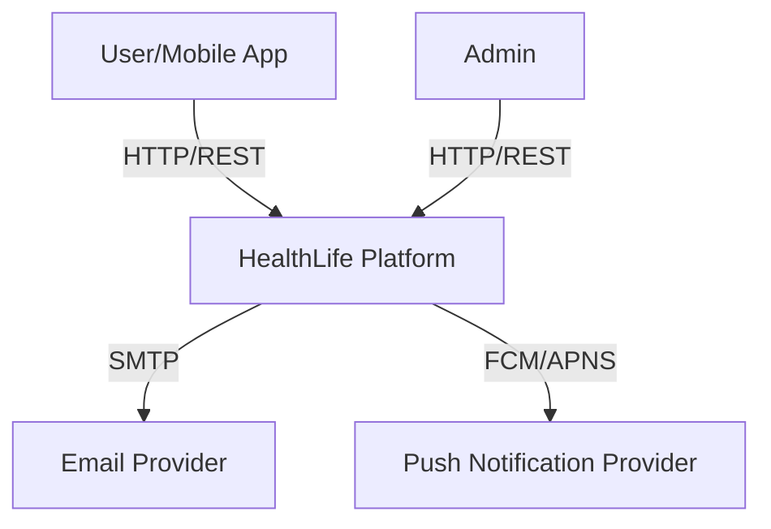
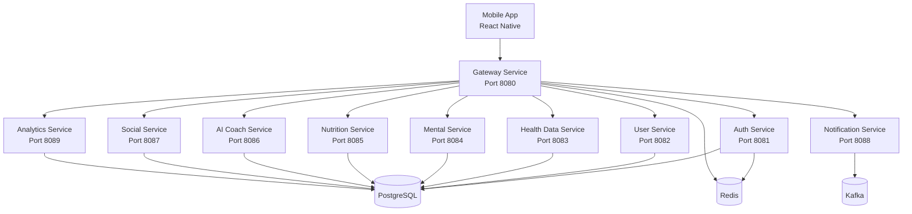

# HealthLife Architecture

## C4 Model

### Context Diagram (Level 1)

### Container Diagram (Level 2)

## Data Flow

1. Client sends request to Gateway with JWT access token
2. Gateway validates token (via JWT signature) and forwards request
3. Target service processes business logic and persists to PostgreSQL
4. Events published to Kafka for async processing (notifications, analytics)
5. Response returned through Gateway to Client

## Technology Decisions

| Decision | Rationale |
|----------|-----------|
| Microservices | Independent scalability and team autonomy |
| Spring Boot 3 | Mature ecosystem, native image support, Java 21 virtual threads |
| PostgreSQL | ACID compliance, rich data types, JSON support |
| Redis | Session caching, rate limiting, distributed locks |
| Kafka | Event sourcing, decoupled async communication |
| Kubernetes | Industry standard container orchestration |
| Helm | Templated, versioned, repeatable deployments |
